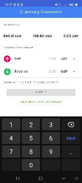

# Exchange

A sample project powered by `exchangeratesapi.io` APIs to simulate a simple USD, EUR, and GBP exchange

## APK

You could find a debug apk under `releases` folder

## Libraries

The project uses some of the official Jetpack libraries including:

- DataStore
- Navigation
- Hilt

And other popular third party libs including:

- Retrofit
- GSON
- OkHttp

## TODOs

- Adding tests (unit testing, integration, and probably UI tests)

